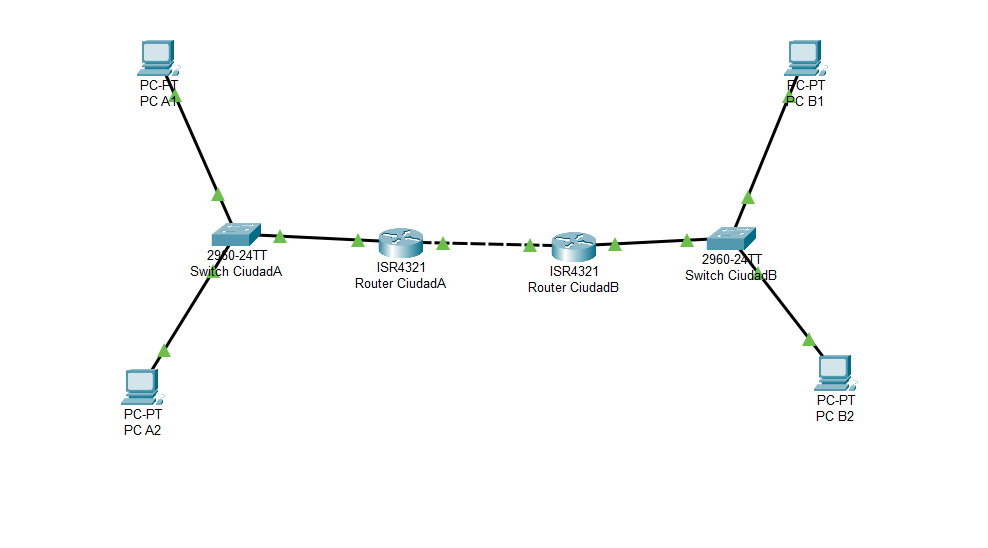
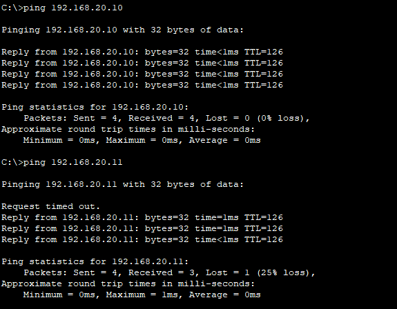
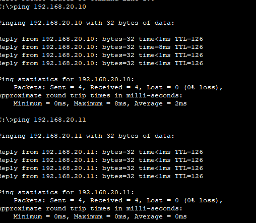
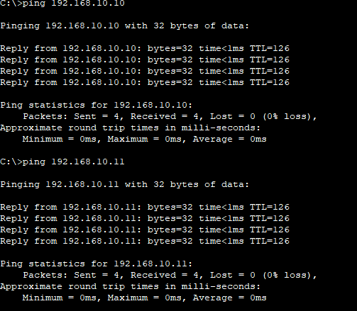
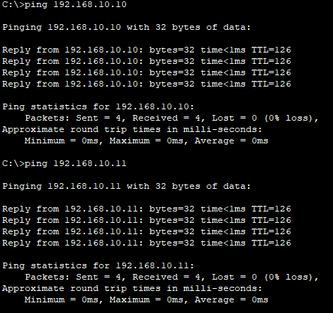
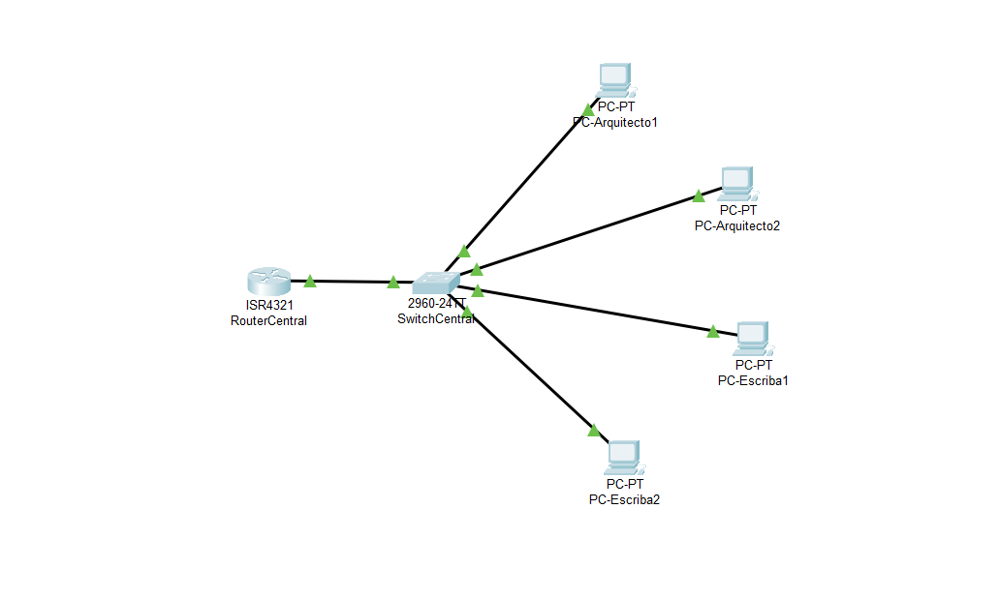
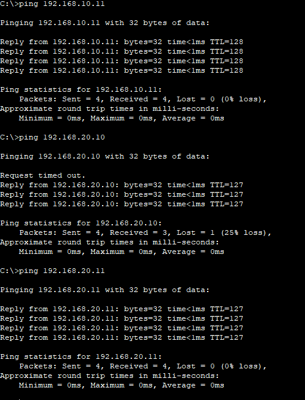
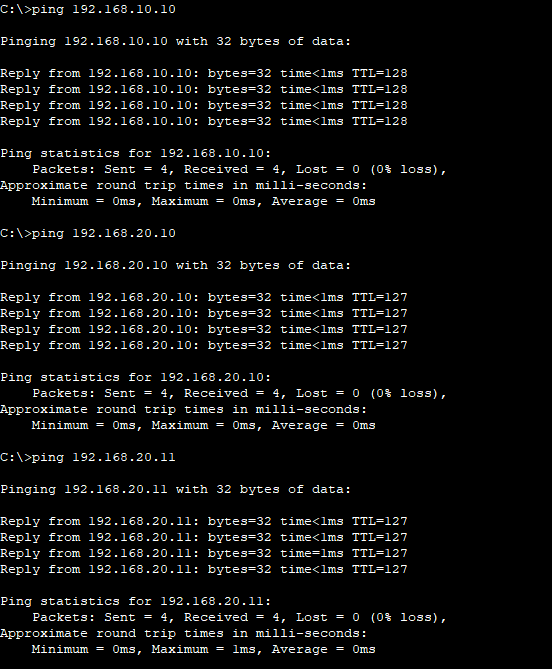
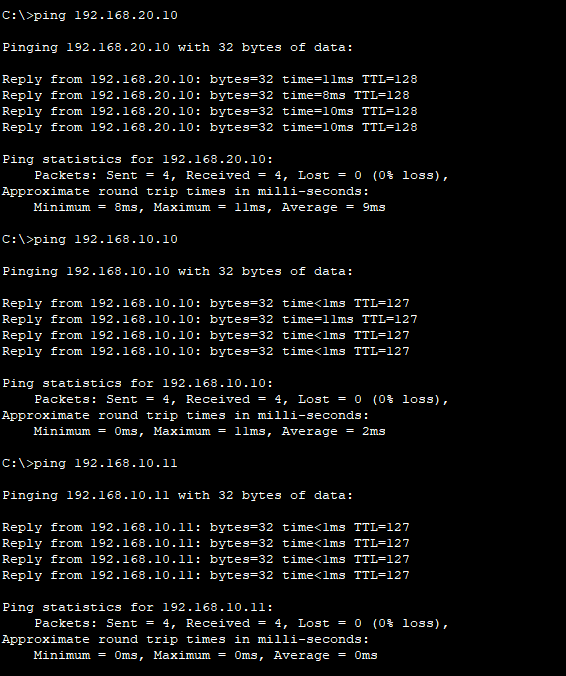
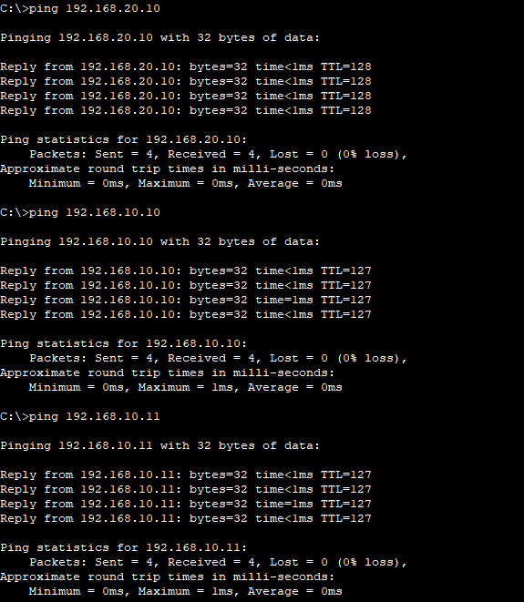

# Examen_Redes
## Parte I: Conceptos y Teoría
### 1. El Mural de las Sietes Capas
El Mural representa el Modelo OSI, un sistema de redes de comunicación actual que explica cómo los datos se mueven entre dispositivos a través de las siete capas existentes.
* En la  Capa Física se definen los medios físicos de transmisión ya sea un cable o el aire.
* La Capa de Enlace de Datos controla el acceso al medio físico y maneja las direcciones MAC.
* La Capa de Red se encarga del enrutamiento y direccionamiento lógico.
* La Capa de Transporte asegura la entrega de datos entre dispositivos sin errores.
* La Capa de Sesión administra las conexiones entre dispositivos.
* La Capa de Presentación gestiona el formato de los datos.
* La Capa de Aplicación es donde los usuarios interactuan con las aplicaciones.

  Al igual que los sabios del templo hacían, en esta época moderna seguimos este modelo de comunicación de manera ordenada y estructurada, de tal forma que cada capa de se encarga de una función, permitiendo así el flujo de información entres un sitio y otro.

### 2. Los Dos Pergaminos del Mensajero
El Ritual del Mensajero Confiable se refiere al protocolo TCP y es que utiliza saludo de tres pasos para asegurar una conexión antes de enviar los datos.

Este protocolo se caracteriza por establecer una conexión antes del envío, asegurar que los paquetes lleguen en orden y completos y el reenvío en caso de que algún paquete se pierda por el camino.

Entre las ventajas destaca su fiabilidad pues los datos siempre llegan correctamente y evita la duplicación o pérdidas de paquetes. Las desventajas serían una velocidad más lenta debido a la verificación recurrente y el alto consumo de recursos que se usan para los reenvíos y confirmaciones.

El Ritual del Mensajero Veloz se refiere al protocolo UDP, pues los mensajes se envían sin establecer una conexión previa ni una respuesta de confirmación.

Entre las ventajas destaca su baja latencia usada en videollamadas o aplicaciones en tiempo real y por un consumo menor de recursos. Sus desventajas serían la pérdida de datos y que no garantiza el orden correcto de estos.

### 3. El Enigma de las Subredes
Para este enigma lo antiguos habrían usado el subneteo.

Para crear 4 subredes se necesitan 4 bits; 2^2 = 4;

Como la máscara original es /24 se toman 2 bits prestados; con lo cual ahora queda /26: 255.255.255.11000000 --> 255.255.255.192.

Cada subred tendrá 2^6 = 64 direcciones totales; 64 - 2 = 62 hosts ultilizables.
1. 192.168.50.0/26
2. 192.168.50.64/26
3. 192.168.50.128/26
4. 192.168.50.192/26

### 4. La Encrucijada de las Rutas
El tótem representa el centro de las redes modernas, una tabla de enrutamiento utilizada por los routers.

Una tabla de enrutamiento es una base de datos que usan los routers para decidir donde se enviar los paquetes. Cuando se recibe un paquete, se consulta su tabla y se escoge la mejor ruta para ser reenvviado.

Las flechas talladas en piedra equivale al enrutamiento estático y las flechas móviles al enrutamiento dinámico. En el caso de las flechas talladas en piedra son rutas fijas que no cambian a menos que sean modificadas mientrsd que las  flechas móviles son rutas que pueden actualizarse si surge algún cambio en la red.

Mientras que el enrutamiento estático es fijo y ofrece control, carece de adaptabilidad a diferencia del dinámico que es felxible, escalable y automatizado.

### 5. El Guardián de la Máscara Única
La historia del Guardían de la Máscara representa al NAT overload, que permite a múltiples dispositivos usar una sola dirección pública, en este caso la máscara del Guardián.

Cuando un dispositivo quiere comunicarse con el exterior, el router (Guardián) reemplaza su dirección IP privada por una dirección IP pública. De este modo, los mensajes parecen provenir de una única IP. Al mismo tiempo el Guardián mantiene una tabla interna para recordar cual era la IP y el puerto, para así cuando llegue una respuesta saber a que dispositivo se debe reenviar.

Usando este método solo se necesita una IP pública para muchos dispositivos, los cual es ideal para las direcciones IPV4 pues estas son limitadas. También como seguridad adicional oculta las redes internas del exterior.

## Parte II:Práctica con Cisco Packet Tracer
### La Ruta Perdida entre Dos Reinos

### Esquema de Direccionamiento IP

| Red               | Dispositivo                             | Interfaz              | Dirección IP        |
|-------------------|-----------------------------------------|-----------------------|---------------------|
| **Red Ciudad A** |                                         |                       | `192.168.10.0/24`   |
|                   | Router-CiudadA                          | GigabitEthernet0/0/0  | `192.168.10.1`      |
|                   | PC-A1                                   | FastEthernet0         | `192.168.10.10`     |
|                   | PC-A2                                   | FastEthernet0         | `192.168.10.11`     |
|                   | Puerta de Enlace PCs A                  |                       | `192.168.10.1`      |
| **Red Ciudad B** |                                         |                       | `192.168.20.0/24`   |
|                   | Router-CiudadB                          | GigabitEthernet0/0/0  | `192.168.20.1`      |
|                   | PC-B1                                   | FastEthernet0         | `192.168.20.10`     |
|                   | PC-B2                                   | FastEthernet0         | `192.168.20.11`     |
|                   | Puerta de Enlace PCs B                  |                       | `192.168.20.1`      |
| **Red Enlace Routers** |                                         |                       | `192.168.30.0/30`   |
|                   | Router-CiudadA                          | GigabitEthernet0/0/1  | `192.168.30.1`      |
|                   | Router-CiudadB                          | GigabitEthernet0/0/1  | `192.168.30.2`      |

<br>

### Configuración de Interfaces en Routers

#### Router-CiudadA:

```
interface GigabitEthernet0/0/0
 ip address 192.168.10.1 255.255.255.0
!
interface GigabitEthernet0/0/1
 ip address 192.168.30.1 255.255.255.252
```
#### Router-CiudadB:
```
interface GigabitEthernet0/0/0
 ip address 192.168.20.1 255.255.255.0
 !
interface GigabitEthernet0/0/1
 ip address 192.168.30.2 255.255.255.252
```

 
#### Como se puede ver en la imagen para Ciudad A1 o PC A1, se hace ping desde A1 hasta B1 y B2
 

#### Como se puede ver en la imagen para Ciudad A2 o PC A2, se hace ping desde A2 hasta B1 y B2
 

 #### Como se puede ver en la imagen para Ciudad B1 o PC B1, se hace ping desde B1 hasta A1 y A2
 

#### Como se puede ver en la imagen para Ciudad B2 o PC B2, se hace ping desde B2 hasta A1 y A2
 
 
### La Ciudad de las Redes Aisladas

Se crearon dos VLANs en el Switch-Central: VLAN 10 (Arquitectos) y VLAN 20 (Escribas). Los puertos FastEthernet0/1 y FastEthernet0/2 se asignaron a VLAN 10 en modo acceso, y los puertos FastEthernet0/3 y FastEthernet0/4 se asignaron a VLAN 20 en modo acceso. El puerto FastEthernet0/24 se configuró como troncal para permitir el tráfico de ambas VLANs hacia el Router-Centra

En el Router-Central, se configuraron dos subinterfaces en la interfaz GigabitEthernet0/0/0:

- GigabitEthernet0/0/0.10: Encapsulación dot1Q 10, dirección IP 192.168.10.1/24 (gateway para VLAN 10).

- GigabitEthernet0/0/0.20: Encapsulación dot1Q 20, dirección IP 192.168.20.1/24 (gateway para VLAN 20). La interfaz física GigabitEthernet0/0/0 también se activó con el comando no shutdown.
  
### Esquema de Direccionamiento IP:

| VLAN              | Red               | Dispositivo                       | Interfaz              | Dirección IP        |
|-------------------|-------------------|-----------------------------------|-----------------------|---------------------|
| **VLAN 10** | `192.168.10.0/24` | Gateway (Router-Central)          | GigabitEthernet0/0/0.10 | `192.168.10.1`      |
| (Arquitectos)     |                   | PC-Arquitecto1                    | FastEthernet0         | `192.168.10.10`     |
|                   |                   | PC-Arquitecto2                    | FastEthernet0         | `192.168.10.11`     |
| **VLAN 20** | `192.168.20.0/24` | Gateway (Router-Central)          | GigabitEthernet0/0/0.20 | `192.168.20.1`      |
| (Escribas)        |                   | PC-Escriba1                     | FastEthernet0         | `192.168.20.10`     |
|                   |                   | PC-Escriba2                     | FastEthernet0         | `192.168.20.11`     |

Diagrama En Busca de la Red Perdida 



A continuación se muestra los pings de Arquitecto 1 a Arquitecto 2, Escriba 1 y Escriba 2


A continuación se muestra los pings de Arquitecto 2 a Arquitecto 1, Escriba 1 y Escriba 2


A continuación se muestra los pings de Escriba 1 a Escriba 2, Arquitecto 1 y Arquitecto 2


A continuación se muestra los pings de Escriba 2 a Escriba 1, Arquitecto 1 y Arquitecto 2


